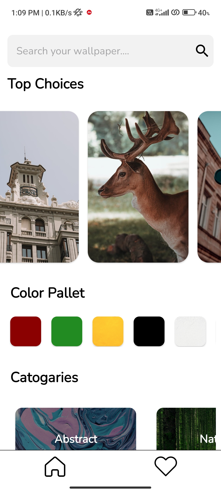
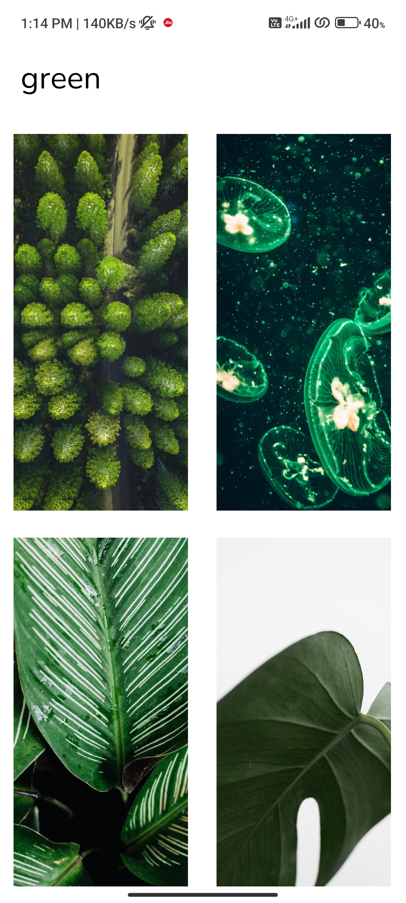
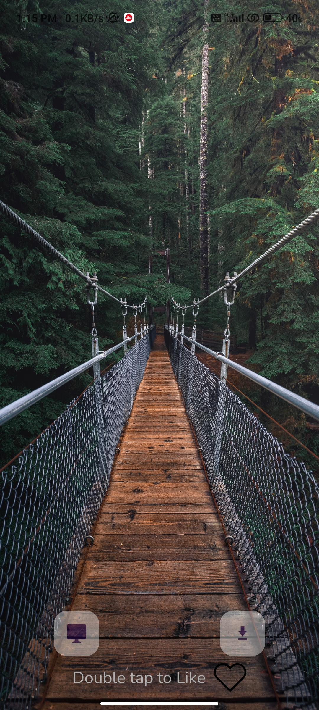
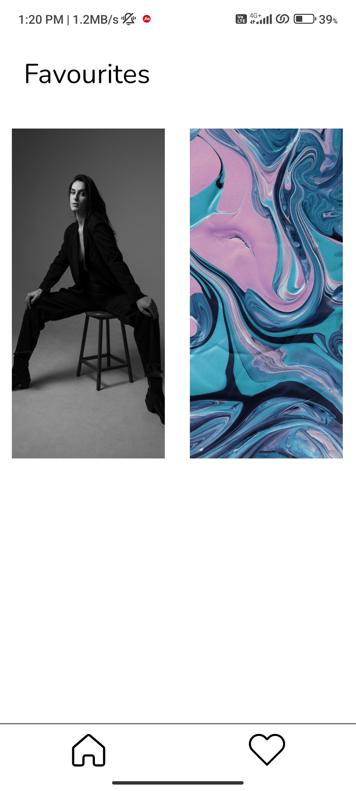

# Random Wallpaper App 🖼️

Welcome to the Random Wallpaper App repository! This Android application allows you to discover and set beautiful wallpapers fetched from the Pexels API. Customize your device's look with stunning images, whether you're searching for something specific, exploring categories, or simply looking for inspiration.

<p align="center">
  
</p>

## Features 🌟

- **Random Wallpaper**: Get a fresh and captivating wallpaper every time you open the app.
- **Search**: Enter keywords to find wallpapers that match your interests.
- **Categories**: Explore wallpapers organized into various categories for easy browsing.
- **Color Categories**: Discover wallpapers based on your preferred colors.
- **Favorites**: Save your favorite wallpapers for quick access and setting.
- **Apply Wallpaper**: Set your chosen wallpaper directly as your device's background.
- **Download**: Download wallpapers to your device's gallery for later use.

## Technologies Used 🛠️

- Android Studio
- Java
- Pexels API
- Volley (for API requests)
- Glide (for image loading)
- RecyclerView (for displaying lists)
- SQLite(Room Library) (for storing favorite wallpapers)
- Permissions (for setting wallpaper and accessing device's gallery)
- Material Design components

## Screenshots 📸

<p align="center">
  
  
    
</p>

<p align="center">
  
  
</p>

## Prerequisites 📋

Before you start, ensure you have the following:

- [Android Studio](https://developer.android.com/studio): The official IDE for Android application development.
- Pexels API Key: Obtain your API key from [Pexels](https://www.pexels.com/api/) to access their extensive wallpaper collection.

## Installation ⚙️

1. Clone this repository to your local machine:

    ```bash
    git clone https://github.com/yourusername/random-wallpaper-app.git
    ```

2. Open the project in Android Studio.

3. Replace `YOUR_API_KEY` in the code with your actual Pexels API key.

4. Build and run the application on an Android emulator or a physical device.

## Usage 🚀

1. Launch the Random Wallpaper App on your Android device.

2. Explore the random wallpaper presented on the home screen, or utilize the search bar to find wallpapers based on keywords.

3. Dive into various wallpaper categories to discover images that resonate with you.

4. Save your favorite wallpapers by tapping the heart icon.

5. Apply the chosen wallpaper directly to your device's background or download it to your device's gallery for later use.

## Configuration ⚙️

Customize the app to your liking:

- **API Key**: Replace `YOUR_API_KEY` with your actual Pexels API key.

## Contributing 👥

Contributions are welcome! Feel free to report bugs, suggest improvements, or contribute through pull requests.

## License 📜

This project is licensed under the MIT License. Check out the [LICENSE](LICENSE) file for details.

---

Experience the magic of beautiful wallpapers with the Random Wallpaper App. Elevate your device's appearance with stunning visuals and explore wallpapers tailored to your taste! 🖼️🌈
